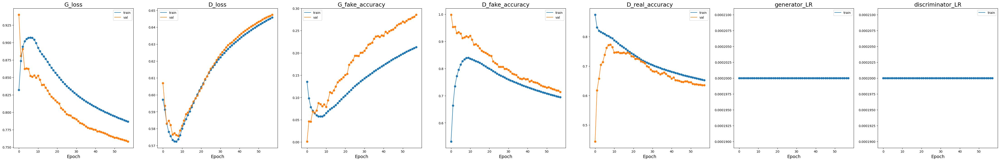
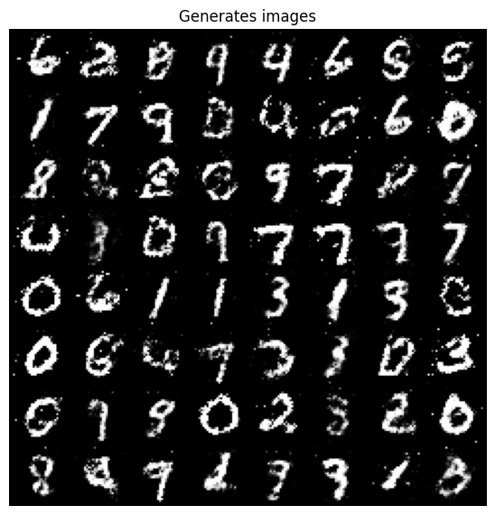
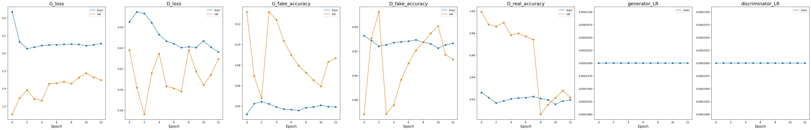
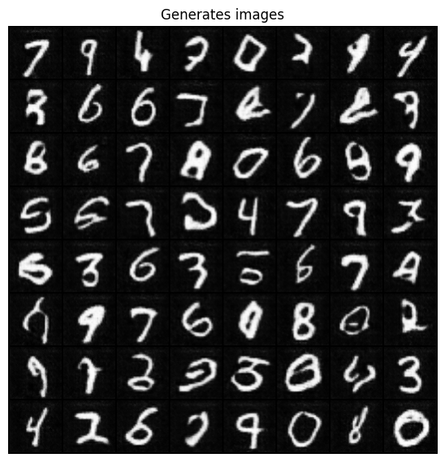

# PyTorch implementation of Generative Adversarial Networks (GAN) 
Implemented models:
* [GAN](https://arxiv.org/abs/1406.2661)
* [DCGAN](https://arxiv.org/abs/1511.06434)

Analysed datasets:
* [MNIST](http://yann.lecun.com/exdb/mnist/)
* [CelebA](http://mmlab.ie.cuhk.edu.hk/projects/CelebA.html)

# MNIST dataset experiments

## GAN

Simple GAN based on [Generative Adversarial Nets](https://arxiv.org/abs/1406.2661) paper
### Learning curves

### Examples of generated images

## DCGAN

GAN based on [Unsupervised Representation Learning with Deep Convolutional Generative Adversarial Networks](https://arxiv.org/abs/1511.06434) paper
### Learning curves

### Examples of generated images

# CelebA dataset experiments
