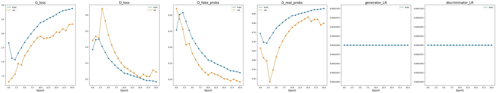

# PyTorch implementation of Generative Adversarial Networks (GAN) 
Implemented models:
* [GAN](https://arxiv.org/abs/1406.2661)
* [DCGAN](https://arxiv.org/abs/1511.06434)
* [Conditional DCGAN](https://arxiv.org/abs/1411.1784)

# MNIST dataset experiments

## GAN ([paper](https://arxiv.org/abs/1406.2661))

### Learning curves

### Examples of generated images in each epoch
https://github.com/thawro/gan-pytorch/assets/50373360/c420da6a-f517-4e50-b123-f59d317e164b

## DCGAN ([paper](https://arxiv.org/abs/1511.06434))

### Learning curves

### Examples of generated images
https://github.com/thawro/gan-pytorch/assets/50373360/337e2b91-ea26-4ac6-b79d-e5d126780c59

## Conditional DCGAN ([paper](https://arxiv.org/abs/1411.1784))

### Learning curves

### Examples of generated images (each row is conditioned with specific digit)
