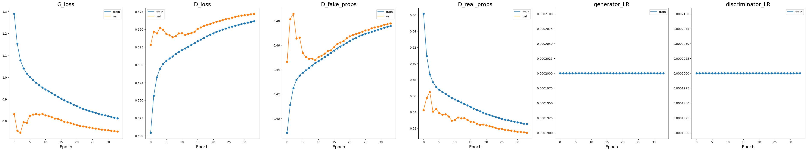

# PyTorch implementation of Generative Adversarial Networks (GAN) 
Implemented models:
* [GAN](https://arxiv.org/abs/1406.2661)
* [DCGAN](https://arxiv.org/abs/1511.06434)
* [Conditional DCGAN](https://arxiv.org/abs/1411.1784)

Analyzed Datasets:
* [MNIST](http://yann.lecun.com/exdb/mnist/)
* [CelebA](http://mmlab.ie.cuhk.edu.hk/projects/CelebA.html)

# MNIST

## GAN

#### Learning curves

#### Generated examples
https://github.com/thawro/gan-pytorch/assets/50373360/c420da6a-f517-4e50-b123-f59d317e164b

## DCGAN

#### Learning curves

### Generated examples
https://github.com/thawro/gan-pytorch/assets/50373360/337e2b91-ea26-4ac6-b79d-e5d126780c59

## Conditional DCGAN

#### Learning curves

#### Examples (each row is conditioned with specific digit)
https://github.com/thawro/gan-pytorch/assets/50373360/79e9d0b0-c291-4d47-835b-19b28bcff0b2

# CelebA

## GAN

#### Learning curves

#### Generated examples

## DCGAN

#### Learning curves

#### Generated examples
